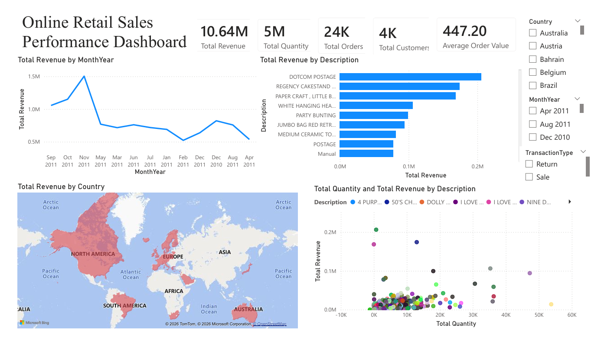
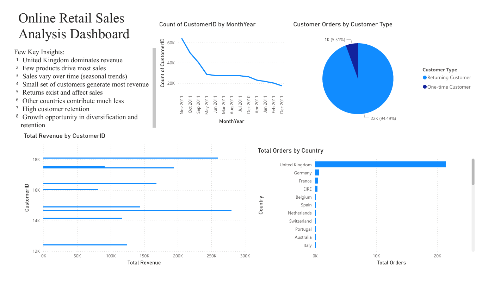

# Online Retail Sales Analysis

## Project Overview

This project performs comprehensive data analysis on online retail sales data. It includes data cleaning, exploratory data analysis (EDA), revenue analytics, and time-series forecasting to identify trends, top-performing products, and geographical revenue patterns.

## Dashboard Preview





## Objectives

- **Data Cleaning & Preparation**: Clean and validate raw retail data for analysis
- **Exploratory Data Analysis**: Understand data structure, distributions, and relationships
- **Revenue Analysis**: Identify top products and countries by revenue
- **Sales Trends**: Analyze monthly revenue patterns over time
- **Demand Forecasting**: Predict future revenue using time-series forecasting (Prophet)
- **Visualization**: Create insightful charts and visualizations for stakeholder communication

## Dataset Description

The project analyzes online retail transaction data with the following key columns:

- **InvoiceNo**: Unique transaction identifier
- **StockCode**: Product code
- **Description**: Product name/description
- **Quantity**: Number of units sold (negative values indicate returns)
- **InvoiceDate**: Date of transaction
- **UnitPrice**: Price per unit
- **CustomerID**: Unique customer identifier
- **Country**: Customer's country

### Data Files

- `online_retail.csv`: Main dataset with transaction records
- `data.csv`: Alternative dataset format
- `Sample - Superstore.csv`: Sample superstore data

## Project Structure

```
Online_Retail_Sales_Analysis/
├── README.md                              # Project documentation
├── Online_Retail_Sales_Analysis.ipynb     # Main Jupyter notebook with analysis
├── Online_Retail_Sales_Analysis.pbix      # Power BI dashboard and visualizations
├── Online_Retail_Sales_Analysis.pdf       # Power BI report export (PDF)
├── OnlineRetail.py                        # Python script with analysis code
└── Datasets/
    ├── online_retail.csv                  # Main dataset
    ├── data.csv                           # Alternative dataset
    └── Sample - Superstore.csv            # Sample data
```

## Installation & Setup

### Requirements

- Python 3.7+
- Jupyter Notebook or JupyterLab
- **Optional**: Microsoft Power BI Desktop (to view and edit the .pbix file)

### Install Dependencies

Run the following command to install required packages:

```bash
pip install pandas numpy matplotlib seaborn prophet
```

Or use the notebook's built-in installation:

```python
!pip install pandas matplotlib seaborn numpy
!pip install prophet
```

## Usage

### Running the Jupyter Notebook

1. Navigate to the project directory
2. Launch Jupyter Notebook:
   
   ```bash
   jupyter notebook
   ```
4. Open `Online_Retail_Sales_Analysis.ipynb`
5. Execute cells sequentially to run the analysis

### Running the Python Script

```bash
python OnlineRetail.py
```

### Viewing Power BI Dashboard

**Option 1: Interactive Dashboard (.pbix)**
- Open `Online_Retail_Sales_Analysis.pbix` with Microsoft Power BI Desktop
- Explore interactive visualizations and drill-down capabilities
- Filter data by country, product, date range, and more
- Use bookmarks for quick navigation between views

**Option 2: PDF Report**
- Open `Online_Retail_Sales_Analysis.pdf` for a static report export
- Perfect for sharing with stakeholders without Power BI access
- Contains all key visualizations and insights

## Analysis Workflow

### 1. **Data Loading & Exploration**
   - Load data from CSV
   - Display basic statistics and info
   - Check for missing and duplicate values

### 2. **Data Cleaning & Transformation**
   - Handle missing CustomerIDs
   - Remove invalid unit prices (≤ 0)
   - Create TransactionType column (Sales vs Returns)
   - Calculate Revenue (Quantity × UnitPrice)

### 3. **Revenue Analysis**
   - **Top Products**: Identify top 10 products by total revenue
   - **Geographic Analysis**: Analyze revenue by country
   - **Transaction Types**: Differentiate between sales and returns

### 4. **Sales Trends**
   - **Monthly Trends**: Analyze revenue patterns month-over-month
   - **Visualization**: Line plots showing revenue progression

### 5. **Forecasting**
   - **Prophet Model**: Time-series forecasting for next 180 days
   - **Future Predictions**: Predict future revenue trends
   - **Visualization**: Plot historical data with forecast

## Key Outputs

### Jupyter Notebook & Python Script Outputs

### Visualizations Generated

- **Monthly Revenue Trend Chart**: Line plot showing revenue over time
- **Top Products Bar Chart**: Top 10 products by revenue
- **Geographic Revenue Chart**: Top 10 countries by revenue
- **Revenue Forecast Chart**: 180-day revenue forecast with confidence intervals

### Power BI Dashboard Features

The `Online_Retail_Sales_Analysis.pbix` Power BI dashboard includes:

- **Interactive Dashboards**: Multi-page reports with comprehensive insights
- **Revenue Analysis**: 
  - Revenue by country (map visualization)
  - Top products by revenue (bar charts)
  - Revenue trends over time (line charts)
- **Sales Performance**:
  - Sales vs. Returns breakdown
  - Customer count and order metrics
  - Transaction analysis by product and region
- **Time Series Analysis**:
  - Monthly revenue trends with drill-down capability
  - Year-over-year comparisons
- **Interactive Filters**:
  - Filter by country, product category, date range
  - Dynamic slicers for customer segments
  - Cross-filtering between visualizations
- **KPI Cards**: Display key metrics at a glance
- **Export Capabilities**: Generate PDF reports directly from Power BI

### Key Metrics Calculated

- Total revenue by product
- Revenue by country
- Monthly revenue trends
- Customer count and order frequency
- Sales vs. Returns ratio

## Key Insights to Explore

- Which products generate the most revenue?
- Which countries contribute most to sales?
- What are the seasonal revenue patterns?
- How does the forecast suggest revenue will change?
- What is the percentage of returns vs. sales?

## Notes

- **Missing Values**: CustomerIDs with missing values are handled by filling with 'Unknown'
- **Data Validation**: Negative quantities are preserved as they represent returns
- **Revenue Calculation**: Based on Quantity × UnitPrice
- **Time Series Data**: InvoiceDate is converted to datetime format for trend analysis

## Data Quality Checks Performed

- ✓ Duplicate records detection
- ✓ Missing value identification
- ✓ Data type validation
- ✓ Outlier detection (negative prices removed)
- ✓ Data shape verification
